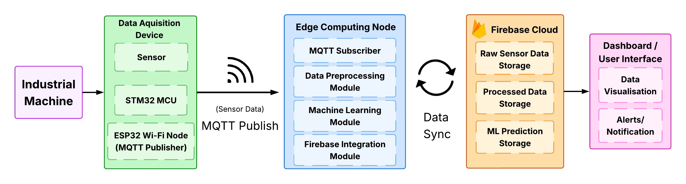

# Nirikshak: Industrial IoT Predictive Maintenance System

<p align="center">
  
</p>

<p align="center">

An Industrial Internet of Things (IIoT) based Predictive Maintenance System for real-time monitoring of industrial motors using a custom STM32 Data Acquisition (DAQ) device, ESP32 wireless communication, and a web-based monitoring dashboard.

</p>

---

## Overview

Nirikshak is a low-cost Industrial IoT (IIoT) solution developed to continuously monitor the health of industrial motors.

The system collects data from multiple sensors using a custom-designed STM32-based DAQ device and wirelessly transmits it through an ESP32 module. The incoming telemetry is processed by a Python backend and visualized on a real-time dashboard, enabling continuous monitoring of machine operating conditions.

The project demonstrates the complete workflow of an embedded monitoring system—from hardware design and firmware development to wireless communication and web-based visualization.

---

# Features

- Real-time industrial motor monitoring
- Custom STM32-based Data Acquisition (DAQ) Device
- ESP32 wireless communication
- Multi-sensor data acquisition
- MQTT/Firebase based data transfer
- Live dashboard visualization
- Custom PCB designed in EasyEDA
- Custom 3D enclosure
- Modular firmware architecture
- Automatic dashboard fallback using simulated telemetry
- Easy-to-expand system architecture

---

# System Architecture

```
Industrial Motor
        │
        ▼
Sensors
│
├── MPU6050 (Vibration)
├── DS18B20 (Temperature)
├── ZMPT101B (Voltage)
├── SCT-013 (Current)
└── Inductive Proximity Sensor (RPM)
        │
        ▼
STM32 BlackPill
(Data Acquisition)
        │
UART
        │
        ▼
ESP32 DevKit V1
        │
Wi-Fi
        │
Firebase / MQTT
        │
Python Backend
        │
Real-Time Dashboard
```

---

# Hardware

## Microcontrollers

- STM32 BlackPill (STM32F411)
- ESP32 DevKit V1

## Sensors

- MPU6050
- DS18B20
- ZMPT101B Voltage Sensor
- SCT-013 Current Sensor
- Inductive Proximity Sensor

---

# Software Stack

| Software | Purpose |
|-----------|---------|
| Arduino IDE | Firmware Development |
| Python | Backend & Dashboard |
| Flask | Web Dashboard |
| Socket.IO | Real-time Dashboard Updates |
| MQTT | Communication |
| Firebase | Cloud Data Storage |
| EasyEDA | PCB Design |
| Git & GitHub | Version Control |

---

# Repository Structure

```
Nirikshak
│
├── Firmware
│   ├── STM32
│   └── ESP32
│
├── Hardware
│   ├── PCB
│   └── 3D_Enclosure
│
├── Dashboard
│   ├── Backend
│   ├── Images
│   └── README.md
│
├── Documentation
│
├── Images
│
├── README.md
└── LICENSE
```

---

# Firmware

The firmware consists of two parts:

### STM32 Firmware

Responsible for:

- Sensor interfacing
- Data acquisition
- Signal processing
- UART communication

### ESP32 Firmware

Responsible for:

- Receiving data from STM32
- Wireless communication
- Sending telemetry to Firebase/MQTT

---

# Dashboard

The dashboard provides real-time visualization of sensor data including:

- Temperature
- Voltage
- Current
- RPM
- Vibration
- Machine Health Status
- Historical Readings
- System Statistics

The complete dashboard source code and setup instructions are available in:

```
Dashboard/README.md
```

---

# PCB

The custom DAQ PCB was designed using EasyEDA.

Included files:

- EasyEDA Project
- PCB Layout
- Schematic
- PCB Images
- 3D PCB View

---

# 3D Enclosure

The repository includes the custom enclosure designed for the DAQ device.

Contents include:

- STEP Files
- Preview Images

---

# Running the Project

## Firmware

Upload:

- STM32 firmware to the STM32 BlackPill
- ESP32 firmware to the ESP32 DevKit

---

## Dashboard

Navigate to the backend directory:

```bash
cd Dashboard/Backend
```

Install dependencies:

```bash
pip install -r requirements.txt
```

Run the dashboard:

```bash
python app.py
```

Open your browser and visit:

```
http://localhost:5000
```

For detailed dashboard instructions, see:

```
Dashboard/README.md
```

---

# Project Gallery

Add screenshots inside:

```
Images/
```

Example:

```
Images/
├── System.png
├── PCB.png
├── Dashboard.png
├── Enclosure.png
└── Hardware.jpg
```

---

# Future Improvements

- Industrial communication protocols (Modbus, CAN)
- OTA firmware updates
- Multi-machine monitoring
- Cloud deployment
- Mobile dashboard
- Edge-based predictive analytics

---

# Author

**Samarth Maheshwari**

Electronics & Telecommunication Engineering

**Areas of Interest**

- Embedded Systems
- Industrial IoT
- Firmware Development
- PCB Design

**GitHub**

https://github.com/SamarthMaheshwari

**LinkedIn**

https://www.linkedin.com/in/samarth-maheshwari-709670259

---

# Acknowledgements

This project was developed as a Final Year Engineering Project to demonstrate an end-to-end Industrial IoT monitoring solution integrating embedded hardware, firmware, wireless communication, and real-time dashboard visualization.

---

# License

This project is licensed under the MIT License.

See the LICENSE file for more information.
